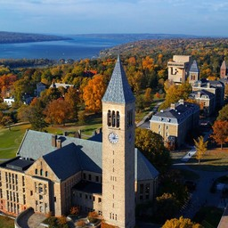
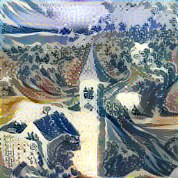
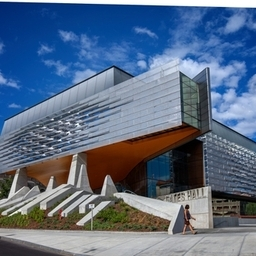
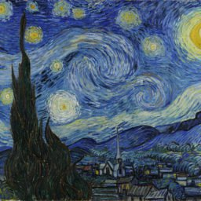
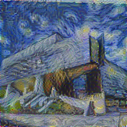

# Neural Style Transfer for Text  

**Members:** [Luca Leeser](https://github.com/ll698) (INFO '18), [Yuji Akimoto](https://github.com/yujiakimoto) (ORIE '19), [Ryan Butler](https://github.com/TheButlah) (CS '19), [Cameron Ibrahim](https://github.com/cai29) (ORIE '20)    

Neural Style Transfer is a technique conventionally used to stylize images, introduced by Gatys et. al. in 2015. It was observed that due to the layered structure of Convolutional Neural Networks, later layers in the network produce feature representations of the content of the image, while correlations between features give a good representation of artistic style. Using a loss function with a content term and a style term, this algorithm is able to iteratively produce an image that combines the content of one image with the style of another.    

Content Image              |  Style Image              | Mixed Image
:-------------------------:|:-------------------------:|:-------------------------:
  |  |  
  |  |  

As shown above, this has proven very successful for images, with variations that provide improvements on speed and quality. However, attempts at style transfer for text have been limited and have not been as successful. We plan to use the concepts from neural style transfer for images to expand on existing research in writing style conversion.    
   
If successful, our algorithm will be able to convert a Yelp review from one writing style to another. This can be used to convert reviews into a style that is more likely to be useful to other users. This is beneficial to Yelp as more people are likely to use their service if reviews are useful, and to individual users as they do not have to put as much effort into writing eloquent reviews. This would also ensure that reviews are judged on the basis of their content instead of preferences over writing style.
