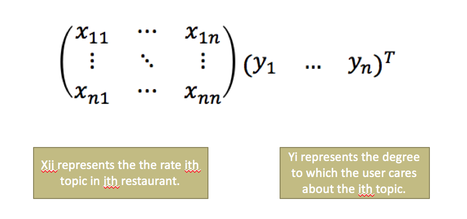
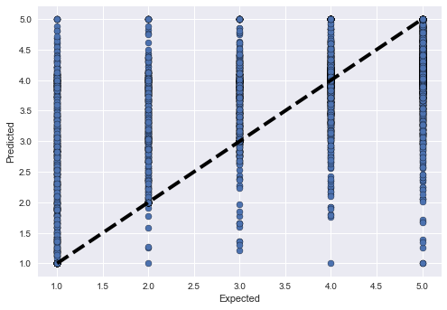

# Extracting Rating Dimensions from Hidden Topics in Text Reviews: a Better Recommendation System
**Members:** Xuwen Shen (STAT '18), Xinzhe Yang (CS '20) 

## Motivation

Currently, the Yelp recommendation system is based on the overall rating for a business, which is the mean of all star ratings given to that business. However, Individual users on Yelp may assign different weights to each aspect when determining their overall score. 

In order to give insights to overall ratings and then create a new personalized recommendation system based on the rating that account for his or her preferences. We were hoping to extract hidden information in reviews including an individual user’s preference and a business’s properties (scores for each feature of the business). We used LDA to get topics from the review. If we have k topics in reviews then we extract k (the same number as the number of topics in Yelp reviews) dimensions in rating for each topic respectively and then use the k dimensional rating to compute the recommendation score for an individual. Finally, we created a model combining the topics and overall ratings to get a personalized ratings for a specific user.

## Background

There is a commonly used recommendation system called Collaborative Filtering, it predicts a user’s rating for a business based on purely overall ratings. It does not perform well on our data. For this reason, we hope to improve the performance by combining text reviews and overall ratings. 
There are two methods which two related parpers are based on:
* Hidden Topics: Understanding Rating Dimensions with Review Text, by [McAuley et. al.](/paper/reating_by_reviews_LDA.pdf)

Use a transformation function to link the topic probability and a business’s properties (scores for each feature of the business).

* Personalizing Ratings, by [Linshi](/paper/YelpDatasetChallengeWinner_PersonalizingRatings.pdf)
Use “Codeword” method to add positive and negative description to topics.

## Data

We use the [Yelp Dataset](https://www.yelp.com/dataset/challenge) to as our source data. More specifically, we are invesitgating the latent topics for all the restaurants in Las Vegas, which has 7298 restaurants and 916554 reviews. After preprocessing, we use those text reviews and rating stars to build our recommendation system.

## Experiment

### Baseline Method

We use [collaborative filtering](https://en.wikipedia.org/wiki/Collaborative_filtering) to predict rating scores without using text reviews as our baseline method. It examines the similarity among all the users and tries to recommend restaurants to users that their similar "neighbors" tend to like.

## Our Method Using Topic Modelling

Our objective is to learn hidden dimensions of behind a overall rating for a specific restaurant by combining latent rating dimensions, such as the topic learned by topic modeling methods like [LDA](https://en.wikipedia.org/wiki/Latent_Dirichlet_allocation).
*	Ran topic model to get topics from reviews written by a user and topics from reviews on a restaurant.
*	Combined topics we learned from the user and the restaurants as topic factors.
*	Learn the hidden dimension of rating by minimizing the mean squared error function.

## Results

After running a small sample of burger places in Las Vegas, our baseline method gives a mean absolute error of **0.9308** while our topic modelling method gives a mean absolute error of **0.703260**. So far, our method beats the baseline. Stay tuned for results on a larger dataset!

