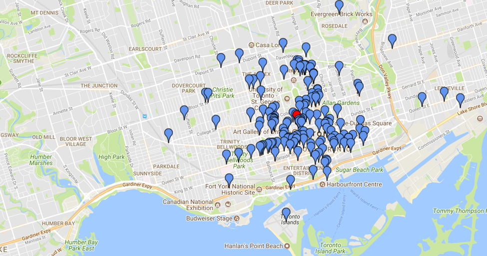

# Local Yelp Expert Identifier  
**Members:** Brandon Kates (BTRY '19), Brian Cheang (CS '20)  

## Motivation
High ratings and awards can drive large tourist crowds into local favorite restaurants, often causing restaurants to change (increase prices, new booking rules, impersonal service) to better accommodate the new customer base. As a result, the most popular and highest-rated restaurants may no longer be true local favorites but instead thrive on their popularity with tourists. By identifying local users and local experts to provide ratings reflective of local opinions, Yelp may become more popular with tourists looking to "travel like a local" and enjoy a more authentic experience.

## Background
The objective of the research project is to build and combine two models (Local Expert Identifier / Topical Expert Identifier) for the purpose of identifying 'experts' among yelp users. The "Local Expert Identifier" is a Gaussian Mixture Model that identifies clusters in a given user's review locations to predict the user's most probable location.

## Experiments:
### Local Expert Identifier
The "Topical Expert Identifier" is currently a supervised learning algorithm that combines different features about the users reviews in a certain category in order to determine if they are an expert in that category. The goal is to see if an unsupervised algorithm would be able to classify users into clusters of expert and non-expert without needing labels. The goal is to combine the models to find local experts in a specific category.  

Local Expert Identifier is originally run on 4000 users with the following thresholds.
- Tdistance = 10 km
- Ttimespan = 500 days
- Treview_count = 10 reviews
- Treview_ratio = 0.36

*Part0:*  Business Yelp Ratings vs Actual User Ratings  
*Part1:*  Business Yelp Ratings by Locals vs Actual Local User Ratings  
*Part2:*  Business Yelp Ratings by Locals over Ttimespan vs Actual Local User Ratings  
*Part3:*  Business Yelp Ratings by Locals over Ttimespan and over Treview_ratios vs Actual Local User Ratings  

### Topical Expert Identifier
The "Topical Expert Identifier" is currently a supervised learning algorithm that combines different features about the users reviews in a certain category in order to determine if they are an expert in that category. The goal is to see if an unsupervised algorithm would be able to classify users into clusters of expert and non-expert without needing labels.

## Results:
