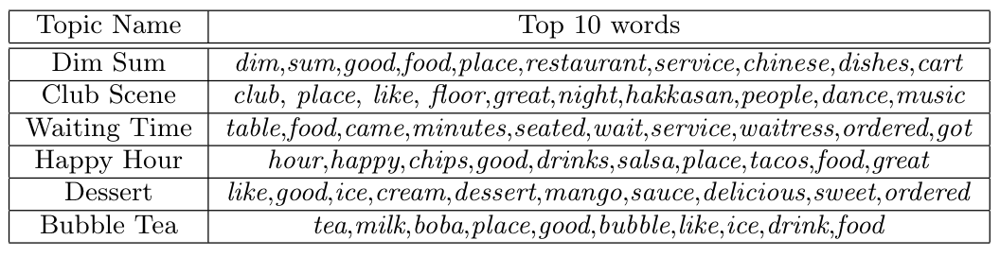
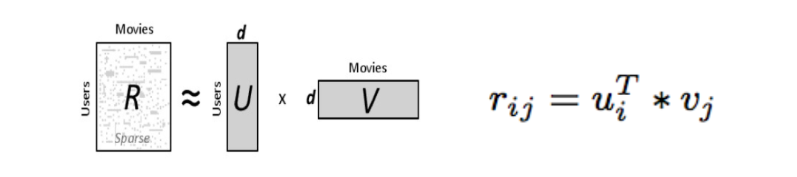
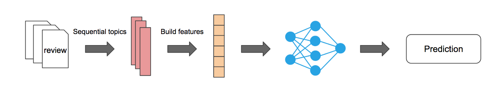

# Topic Modeling as a Trend-Aware Performance Metric
**Members:** Kenta Takatsu (CS '19), Caroline Chang (CS '20)

## Motivation

We believe that Yelp's rating system does not represent temporal information to assess growth of business performance. In order to devise a method to infer trends in Yelp businesses’ performance, we concluded that it is essential to investigate users' direct feedbacks -- review texts. Particularly, we used a method called **topic modeling** to study hidden topics in the reviews. The overarching goal of this project is to develop a star-rating prediction system that will allow users to get a better idea of long-term business performance.  

  
   
  https://www.kibin.com

## Background
We are accomplishing the task by testing and training multi-feature classifiers and comparing which types of classifiers work best when predicting star ratings. The features in our classifiers are different, relevant topics generated using a Latent Dirichlet Allocation (LDA) model. Classifiers we are currently working on are single-feature and multi-feature linear regression. We will be developing SVMs this upcoming week. Another aspect that we intend to study this semester is what an appropriate time interval size would be in order for our classifiers to most optimally predict the next star rating in the next time interval. (i.e. a month, a week, 90 days, etc.)  

The table below shows the result of **topic modeling** for the Chinese restaurant reviews from Yelp data.

  

## Data
In our study, we preprocessed the dataset so that it only contains the reviews for the Chinese category from Yelp Dataset. After preprocessing, the data contains 175,281 reviews from 3,773 businesses, written from December 2004 to July 2017.

## Experiment
We conduct a series of experiments to how accurate our topic models can be with both **supervised learning** and **unsupervised learning**. **Supervised learning** is when you know the "answers" to the data. For example, predicting ratings of reviews with topic is a supervised learning. On the other hand, **unsupervised learning** is when you *don't* know the "answers" to the data. For example, recommendation systems would be unsupervised since we cannot measure the accuracy the algorithms unless we ask users how useful the recommendations are.

### Embeddings
We found multiple issues in traditional LDA model. For example, LDA would give high weights on frequently appearing words such as *food* or *good*. These words can be useful if we are interested in rating prediction; however, we are more interested in business specific terms such as name of menu, specific service, etc. We modified the algorithms and created our embeddings.

### Unsupervised Learning
We built a recommendation system with our topic embeddings using **matrix factorization**. In this system, we recommend the most "informative" positive and negative reviews for business owners based on the review topics.

  

### Supervised Learning
Finally, we use topic models to predict the future trajectory of business trend. In order to achieve this, we used **sequence analysis**, which means we take the sequence of topics as an input and tries to predict the rating of the future. We used multiple classifiers, **support vector machine**, **xgboost**, and **deep neural network**.

  

## Results

### Useful literature
- [Sentence Level Recurrent Topic Model: Letting Topics Speak for Themselves](https://arxiv.org/pdf/1604.02038.pdf)
- [Hidden Factors and Hidden Topics: Understanding Rating Dimensions with Review Text](http://i.stanford.edu/~julian/pdfs/recsys_extended.pdf)
- [Semantic Scan: Detecting Subtle, Spatially Localized Events in Text Streams](https://arxiv.org/pdf/1602.04393.pdf)
- [Dynamic Topic Modeling](http://www.cs.columbia.edu/~blei/papers/BleiLafferty2006a.pdf)
