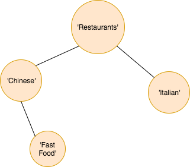

# Business Tag Cooccurrence Network

## Introduction
Business tag co-occurrence analysis for [Yelp Dataset Challenge Round 10](https://www.yelp.com/dataset/challenge).

<p align = 'center'>

</p>

This is a wrapper class to help analyze the co-occurrence of business category tags to determine hierarchical relationship between tags.

CategoryMap object observes the sequence of lists, such as category columns in yelp dataset. For every new tag, CategoryMap object instantiates CategoryNode object, which contains category name and number of appearance. CategoryNode object also contains cooccurrence attribute, which maps the name of category to the number of cooccurrence.

For example, if we observe a sequence of business tags such that
```python
['Restaurants', 'Chinese']
['Restaurants', 'Chinese', 'Fast Food']
['Restaurants', 'Italian']
```
CategoryMap object will create 4 CategoryNode objects as follows:

```python
Node1 = {'name' : 'Restaurants', 'counter' : 3, 'cooccurrence' : {'Chinese':2, 'Fast Food':1, 'Italian':1}}
# node 1 is for Restaurants tag. Since we observed 'Restaurants' tag 3 times, counter gets 3. The tag 'Chinese' appeared with 'Restaurants' twice, and the cooccurrence maps 'Chinese' to 2.
Node2 = {'name' : 'Chinese', 'counter' : 2, 'cooccurrence' : {'Restaurants':2, 'Fast Food':1}}
Node3 = {'name' : 'Fast Food', 'counter' : 1, 'cooccurrence' : {'Restaurants':1,'Chinese':1}}
Node4 = {'name' : 'Italian', 'counter' : 1, 'cooccurrence' : {'Restaurants':1}}
```

## Documentation
#### CategoryNode class
##### Parameters:
*c (str)* : The name of this object
*counter (int)* : The number of times the name above appeared in a sequence
*cooccurrence (dict)* : The dictionary that maps the co-occurred names to the frequency of the co-occurrence
